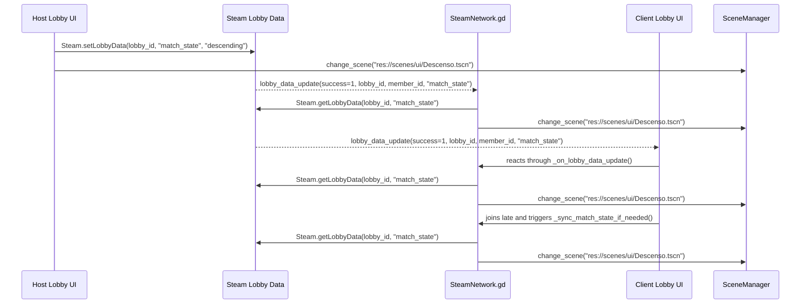

# LOBBY_IMPLEMENTATION_LOG

## 1. Architecture Paradigm Shift

The lobby launch path now uses durable lobby state instead of an immediate transient chat event. The previous `Steam.sendLobbyChatMsg()`-based approach treated match start as a one-shot message, which meant the result depended on callback timing, message delivery order, and whether the node that received the message still existed by the time the callback arrived. That is the exact race that caused the host-side UI to free or replace its lobby nodes before the broadcast could finish propagating.

`Steam.setLobbyData(SteamNetwork.lobby_id, "match_state", "descending")` fixes that by making the host's intent persistent inside the lobby itself. The state remains queryable even after the host scene begins switching away from the lobby, so the launch condition becomes authoritative data rather than a fragile packet. Clients are no longer expected to infer match start from a chat command; instead, they observe a stable lobby key and react to that key only when Steam reports that the value has changed.

This is the important architectural shift:

- Chat messages are ephemeral and depend on the receiving UI node still being alive.
- Lobby data is durable and survives long enough for late callbacks, late joins, and scene changes.
- The host can write the state once and transition locally immediately.
- Clients can read the latest state from Steam whenever they receive `lobby_data_update` or when they join after the lobby has already entered the descending state.

The result is a cleaner authority model. The host writes the match state, `SteamNetwork` interprets it, and `SceneManager` performs the scene change. The UI no longer needs to act as a transport layer for match launch.

## 2. State Machine Flow Chart

Operationally, the flow is identical for every peer after the host writes the state. The only difference is when each peer observes the durable lobby value:

1. The host writes `match_state = descending`.
2. The host changes scene locally without waiting for network round-trip confirmation.
3. Steam emits `lobby_data_update` to connected peers.
4. `SteamNetwork._on_lobby_data_update()` verifies the callback belongs to the active lobby and queries the authoritative value again from Steam.
5. If the value is `descending`, `SteamNetwork._handle_match_state_update()` performs the gameplay transition.
6. If a client joins after the host already started the match, `_sync_match_state_if_needed()` reads the same durable value and routes the player into the gameplay scene immediately.

This sequence avoids any dependence on a transient chat packet and keeps the launch state synchronized across host, clients, and late joiners.

## 3. Complete Code Blueprint

### `scripts/core/Lobby.gd`

`ROLE_DEFINITIONS`

- `electrical_engineer` / `Ingeniero Electrónico` / `summary`: energy and module optimization.
- `mechanic_welder` / `Mecánico / Soldador` / `summary`: repairs, welding, and damage containment.
- `security_officer` / `Oficial de Seguridad` / `summary`: defense, threat control, and perimeter protection.
- `medic_scientist` / `Médico / Científico` / `summary`: crew survival and research support.

`@onready var role_selector: OptionButton = _ensure_role_selector()`

- Ensures the dropdown exists as a UI node reference before `_ready()` starts the data population phase.
- The selector is tied to the lobby UI build path and becomes the source of truth for the visible role entries.

`func _ready() -> void`

- Builds or confirms the lobby UI structure.
- Calls `_populate_roles()` to rebuild the selector from metadata.
- Calls `_sync_initial_role_selection()` so the first role is selected consistently.
- Updates the host button state and connects the UI to `SteamNetwork` signals.

`func _populate_roles() -> void`

- Clears the `OptionButton` completely.
- Iterates through `ROLE_DEFINITIONS`.
- Adds each human-readable label.
- Stores the full dictionary as item metadata with `set_item_metadata()` so the internal role ID and summary remain attached to the UI item.

`func _on_role_selected(index: int) -> void`

- Reads the selected item's metadata through `_get_role_definition(index)`.
- Extracts the internal role ID safely.
- Verifies Steam and lobby state before writing.
- Writes the selected role with `Steam.setLobbyMemberData(SteamNetwork.lobby_id, "role", role_id)`.
- Refreshes the lobby roster display so the role label matches the latest selection.

`func _on_start_pressed() -> void`

- Verifies `SteamNetwork.is_host` first.
- Verifies Steam is initialized.
- Verifies `SteamNetwork.lobby_id != 0`.
- Writes durable lobby state with `Steam.setLobbyData(SteamNetwork.lobby_id, "match_state", "descending")`.
- Immediately changes the local host scene to `res://scenes/ui/Descenso.tscn` through `SceneManager.change_scene(...)`.

`func _resolve_role_label(role_value: String) -> String`

- Maps stored role IDs back to the human-readable labels used in the roster display.
- Keeps the player list readable even if the lobby data still contains the raw internal ID.

### `scripts/managers/SteamNetwork.gd`

`func _initialize_steam() -> void`

- Calls `Steam.steamInitEx(false)`.
- Connects `Steam.lobby_created`, `Steam.lobby_joined`, `Steam.lobby_chat_update`, and `Steam.lobby_data_update`.
- Keeps `lobby_data_update` wired so durable lobby state changes can be observed after the host writes `match_state`.

`func _on_lobby_joined(this_lobby_id: int, _permissions: int, _locked: bool, response: int) -> void`

- Stores the active lobby ID when join succeeds.
- Refreshes `is_host` from the lobby owner.
- Emits `player_list_changed` so the lobby roster refreshes.
- Calls `_sync_match_state_if_needed()` immediately so late joiners do not remain in the lobby if the match already started.

`func _on_lobby_data_update(_success: int, this_lobby_id: int, member_id: int, key: String) -> void`

- Ignores callbacks that fail or belong to another lobby.
- Handles per-member `role` updates by re-reading the member data and emitting `role_updated`.
- Handles lobby-wide `match_state` updates by querying Steam for the latest value and calling `_handle_match_state_update()` when the value is `descending`.

`func _sync_match_state_if_needed() -> void`

- Reads `Steam.getLobbyData(lobby_id, "match_state")` after a join succeeds.
- If the lobby is already in `descending`, it routes the client into the gameplay scene.
- This is the late-join safety trap that prevents abandoned lobby UI for players who connect after the host has already started the match.

`func _handle_match_state_update() -> void`

- Logs the transition with a precise network message.
- Avoids duplicate transitions when the client is already in the Descenso scene.
- Calls `SceneManager.change_scene("res://scenes/ui/Descenso.tscn")` as the authoritative client-side transition.

## 4. Rigorous Live-Testing Protocol

1. Launch the game with at least two running instances so one can host and the other can act as a client.
2. Create a lobby from the host side and confirm the lobby scene loads normally.
3. Verify the role selector shows exactly four visible entries and that each entry corresponds to the official role labels, not placeholder text.
4. Open the lobby roster and confirm the role metadata is still reflected in the member list after each selection.
5. On the host, select each role once and verify the chosen internal role ID is stored in Steam lobby member data under `role`.
6. Confirm the host start button is only available to the host and that the host can press it without any Steam or lobby state errors.
7. Press `Iniciar Descenso` and verify the host immediately changes to `res://scenes/ui/Descenso.tscn` without waiting for a chat message.
8. Observe the client instance and confirm it reacts to `lobby_data_update`, queries the durable `match_state`, and also transitions into `Descenso.tscn`.
9. Re-run the test with a third instance that joins after the host has already started the match.
10. Verify the late joiner does not stay in the lobby scene and instead reads `match_state = descending` through `_sync_match_state_if_needed()`.
11. Confirm there is no remaining dependency on `Steam.sendLobbyChatMsg(...)` for match start.
12. Repeat the flow after a scene reload to ensure the callback wiring still behaves correctly after the lobby UI is rebuilt.
13. If a client remains in the lobby, inspect whether the lobby data callback fired for the active lobby and whether `match_state` was actually set to `descending` on the host.
14. If the host does not transition, verify `SteamNetwork.is_host`, `SteamNetwork.is_steam_running`, and `SteamNetwork.lobby_id` before the start button callback is allowed to proceed.
15. Record the result of each run so the sequence can be compared against the Mermaid diagram above.

This protocol is intentionally repetitive because the failure mode here is timing-sensitive. The point is to prove that the system still works when the host scene changes immediately, when the callback arrives slightly later, and when a peer joins after the match has already begun.