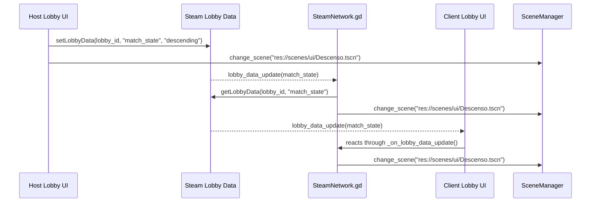

# LOBBY_REFACTOR_COMPLETED

**Status:** [COMPLETED & HARDENED]

## Changelog

- Replaced the lobby role placeholders with a single metadata table containing the four official roles: `electrical_engineer`, `mechanic_welder`, `security_officer`, and `medic_scientist`.
- Updated the role selector to populate directly from metadata so the `OptionButton` no longer depends on hardcoded visible strings.
- Switched the host start action from the fragile `START_DESCENT` lobby chat broadcast to a lobby state write using `Steam.setLobbyData(SteamNetwork.lobby_id, "match_state", "descending")`.
- Preserved the immediate host transition by calling `SceneManager.change_scene("res://scenes/ui/Descenso.tscn")` as soon as the host sets the lobby state.
- Hardened the network reaction path so clients watch `lobby_data_update` and enter the descent scene when the lobby state changes to `descending`.
- Added a join-time fallback so a client entering an already-started lobby can still detect the current `match_state` and transition correctly.

### Why the chat-message approach was deprecated

- Steam lobby chat is an event stream, not durable match state.
- The old `START_DESCENT` command could be missed if a peer was late to process the callback or if the UI node handling the message had already been replaced.
- Chat-based launch logic is brittle when scene transitions free the source node before the callback chain finishes.
- The command string itself was a hidden protocol with no authoritative state to query after the fact.

### Why lobby data fixes the launch path

- Lobby data is persistent lobby state, not a one-shot transient message.
- The host writes the authoritative match state once, and clients can read the latest value even if they join slightly late.
- `lobby_data_update` gives a stable synchronization point that is separate from the UI node lifecycle.
- The client can decide on the current state by reading `match_state` instead of depending on a race-prone broadcast event.

## Applied Architecture Diagram / Flow

## Code Reference

- `scripts/core/Lobby.gd`
  - `ROLE_DEFINITIONS`: metadata source for the four official roles.
  - `_populate_roles()`: clears and rebuilds the `OptionButton` from metadata.
  - `_on_role_selected(index: int)`: writes the selected role into Steam lobby member data.
  - `_on_start_pressed()`: validates host/Steam state, sets `match_state = descending`, and immediately changes the host scene.
  - `_resolve_role_label(role_value: String)`: maps stored role IDs back to the human-readable label.

- `scripts/managers/SteamNetwork.gd`
  - `_initialize_steam()`: connects the Steam callbacks, including `lobby_data_update`.
  - `_on_lobby_data_update(...)`: handles role updates and the new `match_state` transition.
  - `_sync_match_state_if_needed()`: join-time fallback for peers entering an already-started lobby.
  - `_handle_match_state_update()`: authoritative client-side transition when `match_state == descending`.

## Verification Steps

- [ ] Launch a host and confirm the lobby scene shows exactly four role options.
- [ ] Select each role once and verify the chosen value is stored in Steam lobby member data.
- [ ] Confirm the lobby member list displays the official role labels instead of placeholder text.
- [ ] Start the match as host and verify `match_state` is written to the lobby as `descending`.
- [ ] Confirm the host immediately transitions to `res://scenes/ui/Descenso.tscn`.
- [ ] Confirm the client transitions through `lobby_data_update` without requiring `START_DESCENT` chat traffic.
- [ ] Join a lobby after match start and confirm the late joiner still detects `match_state = descending`.
- [ ] Verify there are no remaining match-start dependencies on `Steam.sendLobbyChatMsg(...)`.

## Notes

- The launch flow stays centralized in `SteamNetwork.gd` and `SceneManager.gd`.
- The lobby UI remains lightweight and data-driven.
- The refactor is intentionally narrow: it fixes role selection and match start without introducing a new matchmaking layer.