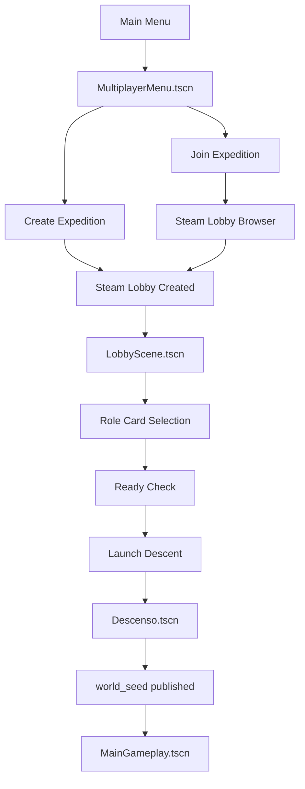

# Project Europa - Multiplayer Flow Technical Summary

## Status

This document records the current refactor slice for the expedition lobby, role selection, ready-check flow, and cinematic handoff. The implementation now separates the multiplayer entry flow from the lobby presentation layer, moves role definitions into resource-backed data, and centralizes Steam lobby state handling in `SteamNetwork.gd`.

## High-Level Flow

The important boundary remains the descent cinematic. The host does not publish `world_seed` until the cinematic has completed, and clients transition into gameplay only after Steam lobby metadata exposes the seed.

## Scene Structure

### Multiplayer Entry

`scenes/ui/multiplayer/MultiplayerMenu.tscn` is the new expedition entry point. It contains:

- Create Expedition button
- Join Expedition button
- Back button
- build/version label
- animated background reuse via `MainMenuBackground.tscn`
- lobby browser panel for discovered Steam lobbies

This scene is intentionally presentation-only. It requests lobby actions from `SteamNetwork` and renders the returned browser state.

### Lobby Scene

`scenes/ui/lobby/LobbyScene.tscn` is the dedicated expedition preparation scene. It is organized around:

- header and lobby metadata display
- player roster panel
- role selection grid
- ready panel
- chat placeholder panel
- launch and back controls

`scenes/ui/Lobby.tscn` now remains as a compatibility wrapper that instantiates the new lobby scene.

### Role Card

`scenes/ui/lobby/RoleCard.tscn` is the reusable tactical specialist card. It renders:

- role name
- portrait placeholder
- role description
- animated stat bars
- selection, occupied, locked, and ready states
- a direct select action

## Data Model

Role definitions are no longer hardcoded in the lobby UI. Instead, the lobby consumes resource-backed class definitions:

- `scripts/data/characters/character_class_res.gd`
- `scripts/data/characters/character_stats_res.gd`
- `scripts/data/characters/character_role_library.gd`
- `resources/characters/electrical_engineer.tres`
- `resources/characters/mechanic_welder.tres`
- `resources/characters/security_officer.tres`
- `resources/characters/medic_scientist.tres`

Each role resource provides:

- `role_id`
- `display_name`
- `description`
- `starting_stats`
- `icon`
- `accent_color`
- `passive_traits`
- `upgrade_hooks`

The lobby scene uses `CharacterRoleLibrary.load_roles()` to discover the resource set dynamically.

## Steam Lobby Synchronization

`scripts/managers/SteamNetwork.gd` is now the authoritative networking coordinator for the pre-game flow.

### Metadata Keys

- `member_role` - selected specialist role for a lobby member
- `member_ready` - ready flag for a lobby member
- `lobby_state` - explicit lobby sync state
- `lobby_version` - version marker for lobby compatibility
- `host_steam_id` - ownership marker for the current expedition
- `world_seed` - deterministic world seed for gameplay

### Lobby States

The flow now models explicit sync states:

- `WAITING_FOR_PLAYERS`
- `ROLE_SELECTION`
- `READY_CHECK`
- `DESCENT_LOADING`
- `CINEMATIC`
- `PUBLISHING_SEED`
- `WAITING_FOR_WORLD_ACKS`
- `LOADING_GAMEPLAY`
- `IN_GAME`

The host drives state changes, while clients observe the lobby metadata and react to updates through Steam callbacks.

### Role and Ready Sync

When a player selects a role or toggles ready:

1. Local UI updates immediately.
2. Steam lobby member metadata is updated.
3. `SteamNetwork` emits the corresponding update signals.
4. All peers refresh occupied and ready state from lobby metadata.

Only one member can occupy a role at a time. The selection logic checks current lobby ownership before accepting a new assignment.

## Deterministic Ordering

Player ordering is no longer based on Steam’s native member iteration order. `SteamNetwork.get_sorted_lobby_member_ids()` sorts members explicitly by Steam ID, which gives the project a stable, repeatable crew order for:

- lobby roster display
- role occupancy checks
- gameplay spawn ordering
- future crew indexing

This is the first step toward deterministic multiplayer presentation and spawn logic.

## Ready Check and Launch

The host launch path is gated by `SteamNetwork.can_host_launch()`.

The current rule set is:

- every connected player must have a valid role
- every connected player must be marked ready
- the host must be in a valid lobby state

If the launch is valid, the host drives the lobby into `DESCENT_LOADING`, then `CINEMATIC`, and transitions into `Descenso.tscn`.

## Descent and Gameplay Handshake

`scripts/Descenso.gd` still owns the cinematic sequence, but world-seed publication is now routed through `SteamNetwork.publish_world_seed()`.

The current handshake is:

1. Host completes the descent cinematic.
2. Host publishes `world_seed` into Steam lobby metadata.
3. Clients observe the seed update and transition into `MainGameplay.tscn`.
4. `GameplayManager.gd` reads the shared seed and spawns crew in deterministic order.
5. Host marks the match `IN_GAME` once gameplay is active.

## Network Responsibilities

### SteamNetwork

`SteamNetwork.gd` now handles:

- Steam initialization and callback registration
- lobby creation and join requests
- lobby browser requests
- lobby metadata writes
- member role metadata
- member ready metadata
- explicit lobby sync state
- seed publication
- late-join synchronization
- deterministic member ordering

### UI Scenes

The UI scenes are limited to state presentation and user actions:

- `MultiplayerMenu.tscn` requests lobby creation or browsing
- `LobbyScene.tscn` renders the roster, role cards, and ready controls
- `RoleCard.tscn` emits selection intent

## Gameplay Integration

`scripts/gameplay/GameplayManager.gd` now consumes the sorted lobby member list instead of raw lobby index order. This keeps spawn assignment stable and reduces dependency on Steam’s internal member ordering.

The gameplay layer also marks the session `IN_GAME` for the host once the scene is active.

## File Inventory

### New Scripts

- `scripts/data/characters/character_stats_res.gd`
- `scripts/data/characters/character_class_res.gd`
- `scripts/data/characters/character_role_library.gd`
- `scripts/ui/lobby/role_card.gd`
- `scripts/ui/lobby/lobby_scene.gd`
- `scripts/ui/multiplayer/multiplayer_menu.gd`

### New Scenes

- `scenes/ui/multiplayer/MultiplayerMenu.tscn`
- `scenes/ui/lobby/LobbyScene.tscn`
- `scenes/ui/lobby/RoleCard.tscn`

### New Resources

- `resources/characters/electrical_engineer.tres`
- `resources/characters/mechanic_welder.tres`
- `resources/characters/security_officer.tres`
- `resources/characters/medic_scientist.tres`

### Updated Scripts

- `scripts/managers/SteamNetwork.gd`
- `scripts/ui/main_menu.gd`
- `scripts/Descenso.gd`
- `scripts/gameplay/GameplayManager.gd`

### Compatibility Wrapper

- `scenes/ui/Lobby.tscn`

## Scalability Notes

This refactor is intentionally structured for expansion.

The next steps can extend the current architecture without rewriting the UI layer:

- add direct invites and passworded lobbies to `MultiplayerMenu`
- add richer lobby browser filtering and sorting
- swap the placeholder chat panel for a real comms view
- add unlockable or DLC specialist resources without changing the card UI
- migrate deterministic ordering from Steam ID sorting to explicit join timestamps if needed
- support dedicated server or matchmaking backends by keeping network authority inside `SteamNetwork`

## Current Validation

The touched scripts currently pass Godot error validation, and the scene files have been cleaned to reference the new flow and wrapper structure.

The remaining work is primarily UI polish and expanding the lobby browser beyond the initial expedition discovery pass.
